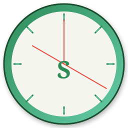

<div align="center">
  
</div>

# ⏰ Simon-Orologio

> 🕐 **Orologio, sveglia, cronometro, timer e fusi orari — in un'unica app.**

Simon-Orologio è un'applicazione orologio semplice ed elegante per GNOME.

---

## ✨ Funzioni

| | Funzione | Descrizione |
|---|----------|-------------|
| 🕐 | **Orologio** | Ora locale in grande, con data completa e giorno della settimana |
| 🌍 | **Fuso orario** | Cities di tutto il mondo, con alba e tramonto |
| ⏰ | **Sveglia** | Sveglie personalizzate, con suoni e ripetizione settimanale |
| ⏱️ | **Cronometro** | Cronometro preciso con giri (lap) e millisecondi |
| ⏲️ | **Timer** | Timer conto alla rovescia con avvio rapido |

---

## ⌨️ Scorciatoie

| Tasto | Azione |
|-------|--------|
| `Alt` + `0` | Orologio |
| `Alt` + `1` | Fuso orario |
| `Alt` + `2` | Sveglia |
| `Alt` + `3` | Cronometro |
| `Alt` + `4` | Timer |
| `F1` | Aiuto |
| `Esc` | Ferma cronometro / reset timer |

---


## 🔨 Compilazione da sorgente

```bash
meson setup builddir --prefix=/usr
ninja -C builddir
sudo ninja -C builddir install
```

## 🗂️ Requisiti

- GTK 4 ≥ 4.14
- libadwaita ≥ 1.5
- Vala ≥ 0.56

---

## 🌐 Lingua

L'applicazione segue la lingua impostata nel sistema.
Le traduzioni italiane sono incluse.

---

## 📄 Licenza

GPL-3.0-or-later.

## 👤 Autore

**Simone**
